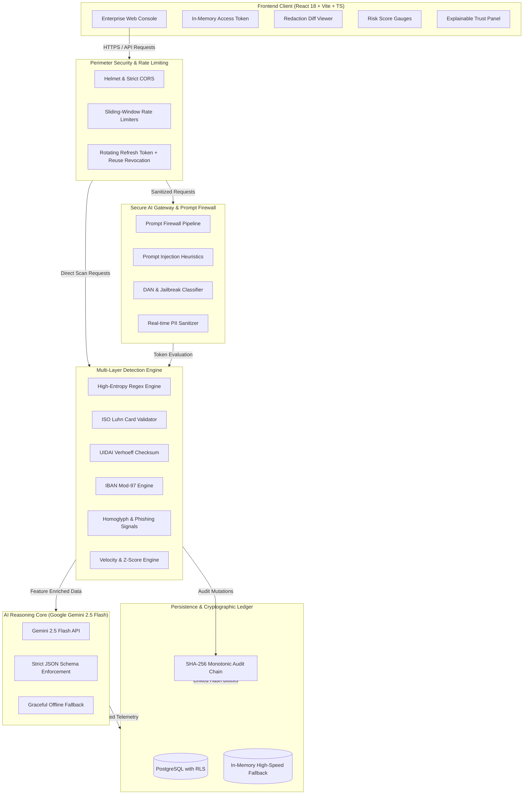

# TrustShield AI — Enterprise AI Security, Privacy & Trust Platform

[](#)
[](#)
[](#)
[](#)
[](#)
[](#)

---

## 1. Problem Statement
Organizations are adopting AI tools and digital channels faster than they can secure them. This creates four connected problems:
1. **Sensitive Data Leakage:** Employees inadvertently paste customer PII (Aadhaar, PAN, SSNs), financial identifiers, and infrastructure API keys into public and internal LLMs without redaction.
2. **Adversarial AI Attacks:** Prompt injection, system prompt exfiltration, and jailbreak payloads bypass naive keyword filters, hijacking agent behavior and compromising corporate security boundaries.
3. **Sophisticated Phishing & Social Engineering:** Modern AI-generated phishing emails, typosquatted homoglyph domains, and coercive smishing scams fool static email gateways.
4. **Opaque AI Decisions & Transaction Fraud:** Traditional security alerts lack explainability and accountability. Security teams cannot verify whether an audit log was tampered with after an incident.

**TrustShield AI** solves these challenges with an integrated, defense-in-depth security perimeter. It protects sensitive identifiers, enforces prompt firewalls, inspects threat vectors, scores financial fraud with human-in-the-loop triage, and seals all operations inside an immutable, cryptographically verifiable SHA-256 audit ledger.

---

## 2. Architecture Diagram



---

## 3. Core Modules & Production Capabilities

### 🛡️ 1. Sensitive Data & Privacy Scanner
- **Deterministic Checksums:** ISO Luhn algorithm for credit/debit cards, UIDAI Verhoeff algorithm for Indian Aadhaar IDs, and ISO 7064 Mod-97-10 for international IBAN bank accounts.
- **Secrets & Token Interception:** High-entropy detectors for AWS Access Keys, Google API Keys, OpenAI API Tokens, GitHub Personal Access Tokens, JWTs, and RSA/EC Private Key PEM blocks.
- **Redaction Modes:** `mask` (e.g. `XXXX-XXXX-1234`), `remove` (e.g. `[REDACTED: AADHAAR]`), and `tokenize` (cryptographic SHA-256 fingerprint).
- **Document Ingestion:** Drag-and-drop support for `.txt`, `.md`, `.csv`, `.pdf`, and `.docx` up to 5MB.
- **Side-by-Side Diff Viewer:** Interactive split and unified before-and-after views with instant clipboard export and sanitized `.txt` download.

### ⚡ 2. Secure AI Gateway & Prompt Firewall
- **Real-Time Perimeter Defense:** Inspects prompts for delimiter attacks, system prompt overrides, DAN (Do Anything Now) jailbreaks, and sensitive data leakage before hitting LLM inference.
- **Transparent Decision States:**
  - `ALLOW`: Clean prompt passed directly.
  - `MASKED & FORWARDED`: Sensitive tokens sanitized before LLM dispatch; original identifiers never leave the firewall boundary.
  - `BLOCKED`: Malicious prompts stopped cold at the perimeter with actionable attack vector diagnostics.
- **Model Integration:** Google Gemini 2.5 Flash with strict JSON schema outputs and graceful fallback when offline.

### 🎣 3. Phishing & Scam Analyzer
- **Multi-Vector Analysis:** Inspects Email, SMS (Smishing), and URLs.
- **Deep Signal Extraction:** Typosquatting homoglyphs (`paypa1` vs `paypal`), IP-based domain hosting, display text vs actual link destination mismatches, urgency and coercive intimidation cues, and SPF/DKIM authentication spoofing.
- **Plain-English Explanations:** Explains *why* the message is dangerous in clear language, accompanied by tactical remediation guidelines for end users.

### 💳 4. Fraud Risk Scoring & Analyst Review Queue
- **Multi-Factor Fraud Engine:** Computes transaction velocity, historical amount Z-score deviations, unrecognized device fingerprints, odd-hours anomalies, and round-amount heuristics.
- **Batch CSV Ingestion:** Evaluates bulk transactional batches and flags anomalous operations into the analyst queue.
- **Human-in-the-Loop Triage:** Interactive analyst drawer for manual disposition (`Approve`, `Reject`, `Escalate Tier 2`) with mandatory audit notes.

### 🔍 5. Explainable Trust Panel & Calibration Feedback
- **Transparent Scoring:** Deconstructs confidence ratings, detection mechanisms (Rule vs AI vs Composite), evidence boundaries, and regulatory exposure (DPDP 2023, GDPR, PCI-DSS).
- **Feedback Loop:** Empowers analysts and users to submit `True Positive`, `False Positive`, or `Misclassified` feedback with notes to calibrate machine learning thresholds.

### 🚨 6. Incident Management & AI Containment Briefs
- **Full Incident Lifecycle:** Status progression across `open` → `investigating` → `contained` → `resolved`.
- **AI Incident Briefs:** Gemini 2.5 Flash generates root cause analyses, containment checklists with interactive progress tracking, and statutory reporting countdowns (6h for CERT-In India, 72h for EU GDPR).
- **Collaboration Feed:** Timestamped activity and evidence logs.

### 📊 7. Executive Security Posture Reports
- **Dynamic Posture Gauges:** Calculates weighted posture scores across data leakage resistance, firewall efficacy, fraud resilience, and audit integrity.
- **Regulatory Crosswalk:** Automated compliance audit for DPDP 2023 (India), GDPR (EU), PCI-DSS v4.0, and SOC 2 Type II.
- **Print & PDF Ready:** Optimized `@media print` stylesheets for instant executive distribution.

### ⛓️ 8. Tamper-Evident SHA-256 Audit Log
- **Immutable Ledger:** Every perimeter scan, prompt block, policy change, and triage disposition is appended to a sequentially chained log.
- **Cryptographic Chaining:** Each block computes `entry_hash = SHA-256(prev_hash + monotonic_timestamp + action + actor + canonical_metadata)`.
- **Integrity Verification:** Instant visual verification tool (`GET /api/audit/verify`) traverses the entire historical ledger from the Genesis root to confirm zero record tampering or deletion.

---

## 4. Pre-Seeded Demo Accounts

The platform includes isolated test accounts ready for demonstration:

| Role | Email | Password | Organization | Privileges |
| :--- | :--- | :--- | :--- | :--- |
| **Org Admin** | `admin@trustshield.io` | `TrustShield@2026!` | Acme Cyber Systems | Full administrative access, policy matrix edits, member role assignment, audit logs |
| **Security Analyst** | `analyst@trustshield.io` | `TrustShield@2026!` | Acme Cyber Systems | Fraud triage queue, incident briefs, detection feedback, report generation |
| **Regular User** | `user@trustshield.io` | `TrustShield@2026!` | Acme Cyber Systems | Privacy scanner, secure gateway chat, phishing analyzer |
| **Isolated Admin** | `admin@fintrust.io` | `FinTrust@2026!` | FinTrust Global | Verifies multi-tenant isolation (cannot view Acme Cyber data or logs) |

*All seed passwords meet the strict complexity policy: minimum 10 characters, uppercase, lowercase, digit, and special character.*

---

## 5. Technology Stack

- **Frontend:**
  - React 18, Vite, TypeScript (Strict Mode)
  - Tailwind CSS, Lucide React, Recharts
  - React Router v6+, TanStack Query (React Query)
  - In-Memory Access Token handling (Zero tokens stored in localStorage/sessionStorage)
- **Backend:**
  - Node.js LTS, Express.js, TypeScript
  - Zod runtime validation on all inputs and LLM outputs
  - PostgreSQL with Row-Level Security (RLS) via `pg` connection pool + transparent in-memory fallback
  - Custom JWT Auth with rotating httpOnly refresh cookies, token reuse detection, and family revocation
  - Google Gemini 2.5 Flash (`@google/genai`)
  - Helmet, Strict CORS, Express Rate Limiters, Pino Logger
- **Testing:**
  - Vitest (34 unit and API integration tests passing)

---

## 6. Quickstart & Local Setup

### Prerequisites
- Node.js 18+ LTS
- npm 9+

### 1. Clone & Install Dependencies
```bash
git clone https://github.com/your-org/trustshield-ai.git
cd trustshield-ai
npm install
```

### 2. Configure Environment Variables
Copy the example environment file for the server:
```bash
cp server/.env.example server/.env
```
*(The server operates out-of-the-box using the built-in in-memory database and rule-based fallback if `DATABASE_URL` or `GEMINI_API_KEY` are not yet populated.)*

### 3. Build Shared Packages, Server & Client
```bash
npm run build
```

### 4. Run the Full Stack Locally
```bash
npm run dev
```
- **Web Console:** [http://localhost:5173](http://localhost:5173)
- **API Server:** [http://localhost:5000/api](http://localhost:5000/api)
- **Health Check:** [http://localhost:5000/api/health](http://localhost:5000/api/health)

### 5. Run Automated Tests
```bash
npm --prefix server test
```

---

## 7. Security Architecture & Threat Defenses

| Threat Vector | Defense Mechanism in TrustShield AI |
| :--- | :--- |
| **XSS & Token Stealing** | Access tokens are kept strictly in JavaScript runtime memory; refresh tokens reside in `httpOnly`, `Secure`, `SameSite=Strict` cookies. |
| **Token Hijacking & Replay** | Refresh token rotation with cryptographic hash indexing. Token reuse triggers immediate revocation of the entire token family. |
| **Brute Force & Credential Stuffing** | Sliding-window IP rate limiting (`10 requests / 15 mins` on `/auth/login`) + automatic account lockout for 30 minutes after 5 consecutive failed attempts. |
| **Prompt Injection & DAN Jailbreaks** | Perimeter heuristics evaluate instruction overrides, system extraction cues, and base64 payloads; scores above threshold are blocked before reaching LLM inference. |
| **PII Exfiltration to External AI** | Automatic pre-masking and tokenization of Aadhaar, PAN, Card numbers, and API secrets prior to sending prompts to model providers. |
| **Audit Log Tampering** | Monotonic SHA-256 hash chaining ensures any modification or deletion invalidates downstream block hashes. |
| **Multi-Tenant Leakage** | All database queries are explicitly organization-scoped (`WHERE organization_id = $1`) with Supabase Row-Level Security (RLS) policies. |

---

## 8. License
Apache-2.0. Built for the NIAT Hackathon — AI Security, Privacy & Trust Track.
